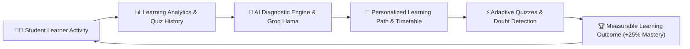
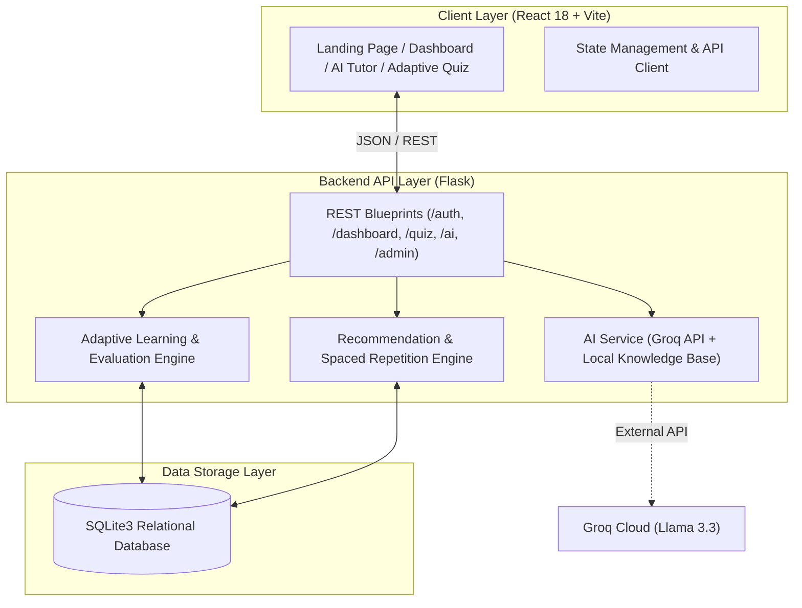

# EduSmart AI – Personalized Smart Learning & Student Success Platform

> **"Learn Smarter. Improve Faster. Succeed Better."**  
> *Developed as an innovative, practical, and scalable software prototype for **Smart India Hackathon 2026**.*

---

## 📌 Problem Statement Alignment
- **Organization Challenge:** AICTE (All India Council for Technical Education)
- **Theme:** Smart Education
- **Category:** Software
- **Problem Statement:** *"Student Innovation – Smart Education: A concept that describes learning in the digital age. It enables learners to learn more effectively, efficiently, flexibly and comfortably."*
- **Important Disclaimer:** *This application is an independent technological prototype developed strictly in response to the problem statement for demonstration and academic evaluation purposes. It does not claim any official affiliation with or endorsement by AICTE or SIH.*

---

## 💡 The Core Problem & Our Solution

### The Core Problem with Traditional Digital Classrooms
1. **Uniform, Static Content:** Every student is served the exact same video lectures and generic PDF material regardless of baseline competency.
2. **Hidden Learning Deficits:** Students remain oblivious to their specific micro-level concept barriers (e.g. call stack overflow during recursion).
3. **No Dynamic Scheduling:** Learners struggle to balance weak subjects against upcoming target dates without personalized guidance.
4. **Delayed Intervention:** Inability to identify learning gaps early leads to high failure rates and placement rejections.

### How EduSmart AI Solves This
EduSmart AI continuously analyzes **student academic level, topic-wise accuracy, learning history, time spent, previous mistakes, and target career goals** to construct a real-time, closed-loop learning experience:



---

## 🚀 Key Innovations & Features

### 1. Continuous Learner Digital Profile
Tracks overall mastery, active streak days, XP, level badges, preferred learning style (Hands-on, Visual, Conceptual), and career aspirations.

### 2. Adaptive Learning & Assessment Engine
- Quizzes dynamically calibrate question difficulty (**Easy, Medium, Hard**).
- Dynamic logic:
  - `Score >= 80%`: Advances difficulty tier and unlocks higher-level material.
  - `Score 60-79%`: Solidifies intermediate scenario challenges.
  - `Score < 60%`: Diagnoses concept gaps, triggers revision, and serves foundational drills.
- Automatically updates topic mastery exponential moving average:  
  $$	ext{New Mastery} = (	ext{Old Mastery} 	imes 0.4) + (	ext{Recent Quiz Score} 	imes 0.6)$$

### 3. Early Doubt Detection & Intelligent Intervention
- When a student commits multiple repeated errors in a topic (e.g. 3 consecutive misses in Recursion), an active **Intervention Banner** is triggered.
- Offers 1-click remedies: **Learn Concept**, **Ask AI Tutor**, and **Practice Easy Questions**.

### 4. AI Personal Tutor (Groq Llama + Built-in Educational Engine)
- Adapts tone and depth to the student's academic level (Beginner, Intermediate, Advanced).
- Features 6 specialized action modes:
  - 💡 **Explain Simply:** Intuitive conceptual breakdowns
  - 💻 **Give Example:** Runnable code snippets in Java, Python, C++, SQL
  - 🧩 **Give Analogy:** Unforgettable real-world metaphors (e.g. Matryoshka dolls for Recursion)
  - 📝 **Practice Question:** Targeted challenges with hints
  - 🪜 **Step-by-Step:** Execution trace with variable state tracking
  - 📋 **Summarize:** Crisp high-yield revision bullet points
- Supports Groq API (`llama-3.3-70b-versatile` / `llama-3.1-8b-instant`) with automatic fallback to a local academic knowledge base if API key is not configured.

### 5. Smart Study Planner
- Generates balanced weekly timetables (Monday–Sunday) scheduling weakest topics early in the week.
- Supports full CRUD on study tasks, toggle completion, and weekly progress tracking.

### 6. "Where Am I Weak?" — Skill Gap Analyzer
- Compares student's current topic mastery against industry benchmark roles:
  - **Software Developer**
  - **Full Stack Web Developer**
  - **Data Scientist**
  - **Cybersecurity Analyst**
- Categorizes skills into **Strong**, **Almost Ready**, and **Needs Improvement**.
- Produces a 4-step actionable career bridge roadmap.

### 7. Smart Spaced-Repetition Revision
- Uses memory decay models ($R = e^{-0.05 \cdot \Delta t}$) to identify decaying topics.
- Provides interactive active-recall flashcards and 1-click review completion.

### 8. AI-Generated Study Material & Concept Explorer
- Deep multi-tab modules: Overview, Key Concepts, Code Examples, Visual State Diagrams, Common Pitfalls, and Mini Quizzes.

### 9. Institutional Admin Portal
- Real-time cohort analytics, engagement metrics (84.2%), topic difficulty heatmaps, student directory, and live question bank creator.

---

## 🛠️ Technology Stack

| Layer | Technology | Rationale |
|---|---|---|
| **Frontend** | React 18, Vite 6, Tailwind CSS | Fast load times, responsive UI, modern 2026 edtech aesthetic |
| **Icons & Visuals** | Lucide React, Pure SVG Charts | Zero external chart library bugs, lightweight and ultra-smooth |
| **Backend** | Python 3, Flask, REST APIs | Clean, modular, robust MVC architecture |
| **Database** | SQLite3 (PRAGMA foreign keys) | Zero infrastructure overhead, easily migratable to PostgreSQL |
| **AI Layer** | Groq Llama 3.3 + Local Smart Engine | Fast inference with guaranteed offline reliability |
| **Security** | SHA256 PBKDF2 Password Hashing, JWT | Industry standard authentication and parameterized SQL queries |

---

## 🏛️ System Architecture



---

## 📂 Project Structure

```
edusmart-ai/
├── backend/
│   ├── app.py                     # Flask entry point & Blueprint registration
│   ├── database/
│   │   ├── db.py                  # SQLite connection helper
│   │   ├── schema.sql             # SQL schema (16 relational tables)
│   │   └── seed.py                # Comprehensive realistic demo data seeder
│   ├── routes/
│   │   ├── auth.py                # Register, Login, Token validation
│   │   ├── dashboard.py           # Dashboard stats, today plan, alerts
│   │   ├── subjects.py            # Subjects, topics, and study materials
│   │   ├── quiz.py                # Adaptive questions, submission, scoring
│   │   ├── study_plan.py          # AI timetable generator & task CRUD
│   │   ├── analytics.py           # Weekly hours, quiz progression, insights
│   │   ├── skill_gap.py           # Career benchmarks & roadmaps
│   │   ├── revision.py            # Spaced repetition queue & flashcards
│   │   ├── ai_tutor.py            # Multi-mode conversational tutoring
│   │   ├── profile.py             # Profile management & onboarding
│   │   └── admin.py               # Institutional analytics & question creator
│   ├── services/
│   │   ├── ai_service.py          # Groq integration + local knowledge engine
│   │   ├── adaptive_engine.py     # Dynamic difficulty & mastery calculator
│   │   └── recommendation_engine.py # Priority next actions
│   └── utils/
│       └── auth.py                # Password hashing and token security
├── frontend/
│   ├── index.html
│   ├── package.json
│   ├── vite.config.js
│   ├── tailwind.config.js
│   └── src/
│       ├── api.js                 # Centralized fetch API client
│       ├── App.jsx                # Router & main application container
│       ├── components/
│       │   ├── Navbar.jsx         # Header with streak, XP, alerts & profile
│       │   ├── Sidebar.jsx        # Responsive navigation drawer
│       │   ├── Charts.jsx         # Pure SVG Bar, Line, Mastery, Gauge charts
│       │   ├── DoubtAlertBanner.jsx # Real-time intervention banner
│       │   └── OnboardingModal.jsx# New learner questionnaire
│       └── pages/
│           ├── LandingPage.jsx    # Hero, pipeline visual, 8 features, impact
│           ├── LoginPage.jsx      # 1-Click Demo student/admin login
│           ├── RegisterPage.jsx   # Full student registration
│           ├── DashboardPage.jsx  # Student KPI hub & learning plan
│           ├── AITutorPage.jsx    # Chatbot with 6 helper modes
│           ├── AdaptiveQuizPage.jsx # Timer, adaptive difficulty, diagnostics
│           ├── StudyPlannerPage.jsx # Calendar & AI timetable generator
│           ├── LearningAnalyticsPage.jsx # Visual charts & pedagogical insight
│           ├── SkillGapPage.jsx   # Role benchmarks & gap roadmaps
│           ├── SmartRevisionPage.jsx # Spaced repetition review queue
│           ├── StudyMaterialPage.jsx # 5-tab topic concept explorer
│           ├── AchievementsPage.jsx # Badges, XP & streak gamification
│           ├── ProfilePage.jsx    # Academic details & settings
│           ├── AdminDashboardPage.jsx # Cohort analytics & question creator
│           └── ImpactPage.jsx     # SIH 2026 Presentation showcase
├── database/
│   └── edusmart.db                # SQLite database (auto-generated)
├── start.bat                      # 1-Click Windows launcher
├── start.ps1                      # PowerShell launcher
├── requirements.txt               # Backend dependencies
├── package.json                   # Root workspace scripts
├── .env.example                   # Environment configuration template
└── README.md                      # Comprehensive documentation
```

---

## ⚡ Quick Setup & How to Run

### Option 1: 1-Click Windows Launcher (Recommended)
Simply double-click:
```bat
start.bat
```
This automatically initializes the database, seeds demo data, starts the Flask backend on port 5000, starts the React frontend on port 5173, and launches your browser!

### Option 2: Manual Step-by-Step

#### 1. Backend Setup
```bash
cd backend
python -m venv venv
# On Windows:
venv\Scripts\activate
# On Mac/Linux:
source venv/bin/activate

pip install -r ../requirements.txt

# Seed database
python database/seed.py

# Start Flask server
python app.py
```
*Backend runs on `http://127.0.0.1:5000`*

#### 2. Frontend Setup
```bash
cd frontend
npm install
npm run dev
```
*Frontend runs on `http://localhost:5173`*

---

## 🔑 Demo Credentials

| Role | Email | Password | Pre-loaded Profile Features |
|---|---|---|---|
| **Demo Student** | `demo@edusmart.ai` | `Demo@123` | B.Tech CSE (3rd Year), Goal: Software Developer, 7-Day Streak, Level 4 (1450 XP), Weak in Recursion (48%), Linked Lists (50%), Active Doubt Alert |
| **Demo Admin** | `admin@edusmart.ai` | `Admin@123` | Dr. A. Sharma (HOD), Cohort Analytics for 245 students, Cohort Difficulty Heatmap, Question Bank Creator |

*(Both accounts are also accessible via instant **1-Click Demo Login** buttons on the login screen!)*

---

## 🎬 Complete Hackathon Demo Walkthrough (Step-by-Step)

Follow this exact flow during your SIH presentation:

1. **Landing Page:** Open `http://localhost:5173`. Show the modern edtech aesthetic, the **AICTE Smart Education Problem Statement alignment**, the **5-step Learning Pipeline** (`Student → Learning Data → AI Analysis → Personalized Plan → Better Outcomes`), and the **Traditional LMS vs EduSmart AI** comparison.
2. **1-Click Login:** Click **Quick Demo Login**, then click **Demo Student**.
3. **Personalized Dashboard:** Point out:
   - Student details: B.Tech CSE, 3rd Year, Software Developer Target.
   - Key Stats: **7-Day Streak**, **Level 4 Scholar**, **1450 XP**, **74% Overall Progress**.
   - **Active Doubt Alert:** *"💡 We noticed you may be struggling with Recursion & Backtracking (48% mastery, 3 recent mistakes)."*
   - **Today's Learning Plan:** AI-generated timetable with checkboxes.
4. **Learning Analytics:** Click **Learning Analytics** on the sidebar.
   - View the **Weekly Study Hours** bar chart and **Adaptive Quiz Trend** line chart.
   - Show the AI Pedagogical Diagnosis identifying DSA / Recursion as the primary hurdle.
5. **Adaptive Assessment:** Click **Adaptive Quiz** on sidebar.
   - Topic defaults to **Recursion & Backtracking**.
   - Click **Start Adaptive Quiz Now**.
   - Answer the multiple-choice questions. Observe the countdown timer and question difficulty badges.
   - Click **Submit Assessment**.
   - Review the post-quiz evaluation: Score percentage, XP awarded, **Strong vs Weak areas**, and the **Adaptive Engine Diagnostics**.
6. **AI Personal Tutor:** Click **Ask AI Tutor About Mistakes** (or navigate via sidebar).
   - Show the context-aware tutor adapting to **Intermediate Level**.
   - Click **💡 Explain Simply** or type *"Explain recursion like I'm a beginner"*.
   - Click **🧩 Give Analogy** to see the Russian nesting doll metaphor.
   - Click **💻 Give Example** to see annotated code.
7. **Smart Study Planner:** Navigate to **Smart Study Planner**.
   - Show how the AI timetable placed Recursion and DSA earlier in the week.
   - Click **Generate AI Study Plan** to see live algorithmic re-balancing.
   - Toggle task completion to see the weekly progress bar advance.
8. **Skill Gap Analyzer:** Navigate to **Skill Gap Analyzer**.
   - Select target role: **Software Developer**.
   - Show the **74% Job Readiness Gauge**.
   - Compare required vs current skill bars (Java: Strong, DSA: Needs Improvement, SQL: Almost Ready).
   - Review the **4-Step AI Career Bridge Roadmap**.
9. **Smart Spaced Revision:** Navigate to **Smart Revision**.
   - Showcase the **Active Recall Flashcard Widget** with reveal answer.
   - Review the **Overdue for Revision** queue based on retention decay.
   - Click **Mark Reviewed (+5%)** to demonstrate instant mastery reinforcement.
10. **Admin Portal:** Click the profile dropdown and select **Switch to Admin Portal** (or login as `admin@edusmart.ai`).
    - Showcase institutional cohort metrics (245 students, 89 active today, 72.4% cohort average).
    - Point out the **Cohort Stumbling Blocks Heatmap** (Recursion at 46% cohort average).
    - Demonstrate the **Live Question Creator** adding new items to the database.

---

## 🌍 Real-World Educational Impact

1. **For Students:** Self-paced mastery, early eradication of blind spots, higher placement clearance rates, and sustained study discipline.
2. **For Teachers:** Cohort stumbling block heatmaps, 24/7 automated tier-1 doubt answering, and proactive identification of at-risk students before exams.
3. **For Institutions:** Measurable Outcome-Based Education (OBE) compliance for accreditation, higher placement conversion statistics, and zero licensing overhead.
4. **For Government & AICTE:** Democratizes elite personalized tutoring for Tier-2/3 and rural technical colleges in direct alignment with **National Education Policy (NEP) 2020**.

---

## 🔮 Scalability & Future Scope
- **PostgreSQL / MySQL Migration:** Built with modular SQL abstraction, allowing seamless migration for multi-tenant universities.
- **Multilingual Support:** Ready to integrate Bhashini / Indic translation for regional language tutoring.
- **Automated Coding Sandbox:** Adding Pyodide / WebAssembly in-browser compiler for live coding evaluation.
- **Institutional SIS Integration:** Pluggable with university ERPs via standard LTI (Learning Tools Interoperability) protocols.

---

*EduSmart AI – Built for Smart India Hackathon 2026. Prototype developed in response to AICTE Smart Education Theme.*
# EduSmart-AI-Personalized-Smart-Learning-Student-Success-Platform

# Smart_Education_Project

# Smart_Education_Project

# Smart_Education_Project

# Smart_Education_Project

# Smart_Education_Project

# Smart_Education_Project

# Smart_Education

# Smart_Education

